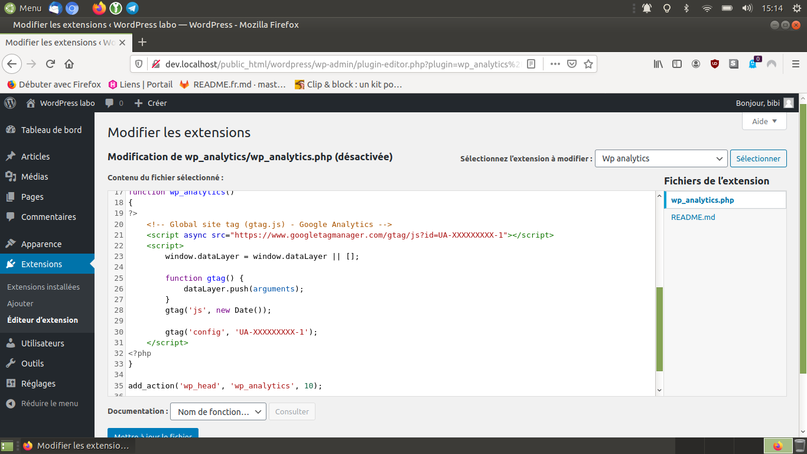

> **Description du projet**: Intégrer le tag de suivi d'[analytics](https://analytics.google.com/) dans le head. Le paramètrer au travers du menu **Editeur d'extensions**. Il ne fait que cela.

* * *

## Inspiration(s), source(s)

* bibibricodeur

## License

[The Unlicense](https://choosealicense.com/licenses/unlicense/)

### Fin
